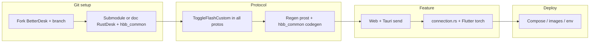

# Plan: Your BetterDesk on Git, your RustDesk fork, then flashlight

## Goal

You end up with:

1. **A GitHub repo you own** containing BetterDesk plus your customizations.
2. **Your RustDesk fork** (and **`hbb_common`** fork if you change protos) referenced in a repeatable way—no mystery copies on disk.
3. **Flashlight / torch control** from the BetterDesk web remote (RustDesk transport) to your **custom mobile build**, via protobuf `Misc.toggle_flash_custom` (`ToggleFlashCustom` message, field **39** in `Misc`’s `oneof`, consistent across trees).

**Your canonical BetterDesk fork**

- SSH: `git@github.com:shamstabraiz/BetterDesk.git`
- HTTPS: `https://github.com/shamstabraiz/BetterDesk.git`

Use this as **`origin`** (or `github`) for the machine where you develop; collaborators clone from the same URL.

---

## Phase 1 — BetterDesk on your Git

1. **Remote**  
   - If this tree has no `origin` yet:  
     `git remote add origin git@github.com:shamstabraiz/BetterDesk.git`  
   - If `origin` points elsewhere, either replace it or add a named remote, e.g.  
     `git remote add github git@github.com:shamstabraiz/BetterDesk.git`

2. **Clean working copy**  
   - `git status` — ensure no secrets (`.env`, API keys, `id_ed25519`, local Docker overrides). Extend `.gitignore` if needed.

3. **Branch**  
   - e.g. `git checkout -b feature/rustdesk-flashlight` for all protocol + UI work.

4. **Push**  
   - `git push -u origin feature/rustdesk-flashlight` (or `git push -u github feature/rustdesk-flashlight` if you named the remote `github`).

5. **Optional**  
   - On GitHub: protect `main`, use PRs from `feature/*` for review.

---

## Phase 2 — RustDesk fork inside or beside BetterDesk

Pick **one** layout and document it in the repo `README` or `docs/plans/`:

| Approach | Pros | Cons |
|----------|------|------|
| **A. Git submodule** `rustdesk/` → `git@github.com:shamstabraiz/rustdesk.git` | Clear version pin; smaller main repo | Submodule UX; CI must `submodule update` |
| **B. Vendored tree** `third_party/rustdesk/` committed | Simple clone | Large; merge upstream harder |
| **C. Side-by-side** folders; no submodule | Flexible | Not reproducible from one clone |

**Critical:** RustDesk’s **`libs/hbb_common`** is a submodule pointing at upstream. If you change **`protos/message.proto`**, you should:

- **Fork** `hbb_common` on GitHub, apply the same proto change there, and  
- **Change `.gitmodules`** in your `rustdesk` fork to your `hbb_common` URL, then commit the submodule pointer.

Otherwise collaborators run `git submodule update` and **lose** your proto edits.

**Document** in BetterDesk:

- Path to RustDesk repo.
- Exact commands: `git submodule update --init --recursive` (if using submodules).
- Which **hbb_common** commit/tag your BetterDesk branch expects.

---

## Phase 3 — Single story for protobuf (`ToggleFlashCustom`)

**Files that must stay aligned** (same field numbers and message names):

- [`web-nodejs/protos/message.proto`](../web-nodejs/protos/message.proto) — browser `protobuf.load('/protos/message.proto')`
- [`betterdesk-mgmt/src-tauri/protos/message.proto`](../betterdesk-mgmt/src-tauri/protos/message.proto) — `prost` in `build.rs`
- [`rustdesk/libs/hbb_common/protos/message.proto`](../rustdesk/libs/hbb_common/protos/message.proto) — RustDesk / `protobuf-codegen`

**Add:**

```protobuf
message ToggleFlashCustom {}

// inside message Misc { oneof union { ... } }
ToggleFlashCustom toggle_flash_custom = 39;
```

(Use **39** only if nothing else claims it after you merge from upstream.)

**Rule:** Any PR that touches one of these files must either update all three or add a small script/note (`docs/plans/PROTO_SYNC.md`) listing the three paths so reviewers do not miss one.

---

## Phase 4 — Regenerate and wire (after proto lands)

1. **betterdesk-mgmt**  
   - `cd betterdesk-mgmt/src-tauri && cargo build`  
   - Confirms `src/proto/hbb.rs` includes `misc::Union::ToggleFlashCustom` (or equivalent generated name).

2. **rustdesk**  
   - Build once in `rustdesk/` so `hbb_common` regenerates Rust protobuf types.  
   - Fix compile errors in `client.rs` / `connection.rs` only after codegen exists.

3. **Web**  
   - `protocol.js`: `buildToggleFlashCustom()`  
   - `client.js`: `sendToggleFlashCustom()`  
   - `remote.ejs` / `remote.js`: toolbar control calling `sendToggleFlashCustom` when transport is **rd**  
   - [`web-nodejs/lang/en.json`](../web-nodejs/lang/en.json) (+ other locales you care about): `remote.toggle_flashlight`

4. **Tauri mgmt** (optional but good for parity)  
   - `SessionCommand::ToggleFlashCustom`  
   - `handle_command` sends `PeerMessage` `Misc` with new union  
   - `send_remote_input` maps `kind: "toggle_flash_custom"` for [`RemoteView.tsx`](../betterdesk-mgmt/src/components/RemoteView.tsx) if you add a button later

5. **RustDesk controlled side**  
   - [`rustdesk/src/client.rs`](../rustdesk/src/client.rs): method mirroring `restart_remote_device()` but sets `toggle_flash_custom`  
   - [`rustdesk/src/server/connection.rs`](../rustdesk/src/server/connection.rs): `match` arm; on **Android/iOS** push a **Flutter global event** JSON like `{"name":"toggle_flash_custom"}` so Dart can call Camera / torch API  
   - **Flutter:** subscribe to that stream and toggle torch (plugin of your choice)

---

## Phase 5 — Optional: CDAP + JPEG paths (non–RustDesk)

If you still need **OS agent** or **JPEG management agent** without RustDesk:

- **CDAP:** `toggle_flash_custom` JSON in [`cdap_handlers.go`](../betterdesk-server/api/cdap_handlers.go) → device message → [`betterdesk-agent`](../betterdesk-agent/agent/agent.go) handler.  
- **JPEG relay:** fix flattened input JSON in [`remote/mod.rs`](../betterdesk-mgmt/src-tauri/src/remote/mod.rs) and handle `toggle_flash_custom` in `inject_input` (see older plan).

These are **orthogonal** to protobuf; same product name `toggle_flash_custom` is fine on the wire for JSON paths.

---

## Phase 5b — Docker, Compose, and deployments (use “your” RustDesk stack)

Today this repo’s main stack is **not** separate upstream `hbbs` / `hbbr` containers. The **server** service in [`docker-compose.yml`](../docker-compose.yml) builds [`Dockerfile.server`](../Dockerfile.server) into a single **BetterDesk Go binary** that speaks a **RustDesk-compatible** signal + relay + HTTP API. Data and keys still live under **`/opt/rustdesk`** on the host volume (historical path compatibility).

**Adding only `ToggleFlashCustom` on the client wire** usually **does not** require a new server image: relay/signal forward opaque `Message` blobs, and unknown `Misc` oneof members are typically ignored by peers that do not decode them.

Update **deployments** when any of these are true:

| Situation | What to change |
|-----------|----------------|
| You publish **custom Docker images** for your fork (console, server, agent) | In compose: `image: ghcr.io/shamstabraiz/betterdesk-console:tag` (example) instead of `build:` — or keep `build: context: .` on branch [`shamstabraiz/BetterDesk`](https://github.com/shamstabraiz/BetterDesk). |
| You replace BetterDesk server with **forked rustdesk-server** (`hbbs`/`hbbr` split) | Add services for your images; set console env **`HBBS_API_URL`**, **`WS_HBBS_HOST`**, **`WS_HBBS_PORT`**, **`WS_HBBR_HOST`**, **`WS_HBBR_PORT`** to reach those containers (see [`docker-compose.yml`](../docker-compose.yml) `console` service). Mount the same key/API material the clients expect (equivalent to today’s `/opt/rustdesk` layout). |
| You **fork `betterdesk-server`** (Go) to change relay behavior for new protobuf | Rebuild from your fork: change [`Dockerfile.server`](../Dockerfile.server) `COPY betterdesk-server/` source or `build.context`; tag and push; compose `server.image` or `build.dockerfile` as needed. |
| **Kubernetes / non-Docker** | Mirror the same env vars and volume semantics: `RUSTDESK_PATH` / `DB_PATH` / `PUB_KEY_PATH` / `API_KEY_PATH` / `KEYS_PATH` as in [`Dockerfile`](../Dockerfile) / compose `console` block. |

**Checklist (commit in your `BetterDesk` fork)**

1. **`docker-compose.yml`** — No secrets in the committed file: move passwords and IPs to `.env` / CI variables (your current compose may still contain examples to sanitize).  
2. **`Dockerfile.console` / `Dockerfile.server`** — If RustDesk-related base images or copied binaries change, document the tag and provenance (fork URL, commit).  
3. **`docs/docker/`** — Update [`DOCKER_QUICKSTART.md`](../docker/DOCKER_QUICKSTART.md) / [`DOCKER_SUPPORT.md`](../docker/DOCKER_SUPPORT.md) if you switch from the all-in-one server to split hbbs/hbbr.  
4. **CI** — If you use GitHub Actions, add `submodule update --recursive` when the console build depends on vendored `rustdesk/` or protos.  
5. **Smoke test** — After deploy: web remote `rd` session still connects; relay ports match firewall (`21116`–`21119` patterns per your compose).

---

## Phase 6 — Verify and ship

- **Happy path:** Web `/remote/:id` (transport `rd`) → your **forked Flutter** controlled app → torch toggles; logs show handler ran.  
- **Interop:** Connect to a **stock** RustDesk peer; ensure unknown `Misc` fields do not crash decode (proto3 behavior / library-specific—verify once).  
- **Legal:** RustDesk is **AGPL-3.0**. If you **distribute** combined or modified RustDesk binaries, comply with AGPL (source offer, etc.). Your BetterDesk license may differ; keep attribution and license files clear.

---

## Suggested timeline



---

## What this plan supersedes for day-to-day work

Treat this document as the **master** checklist for “my Git copy + RustDesk + flashlight.” The older flash-toggle plan in Cursor’s global plans folder can remain as appendix; **repo-relative truth** is this file under `docs/plans/`.
